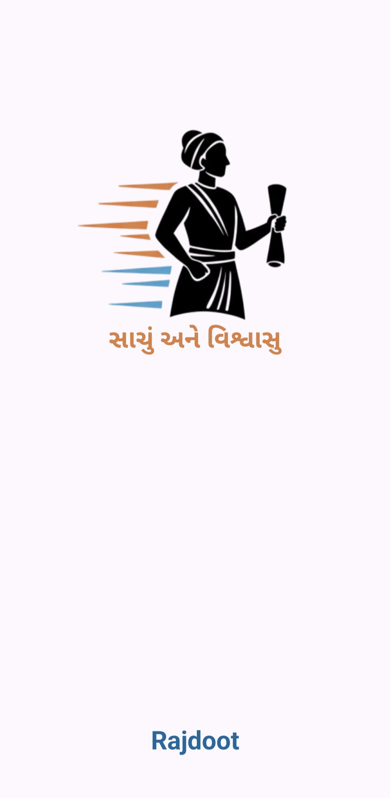
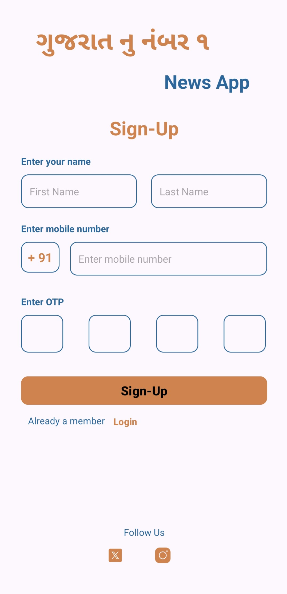
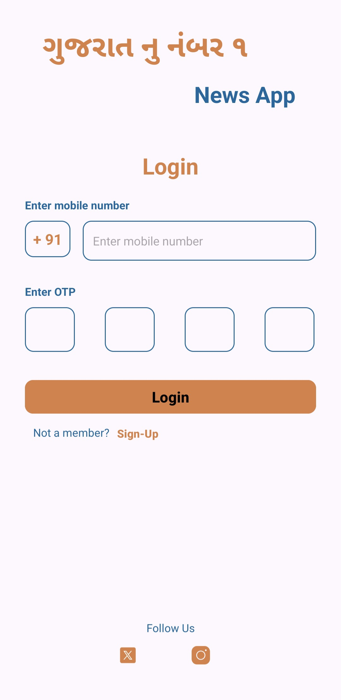
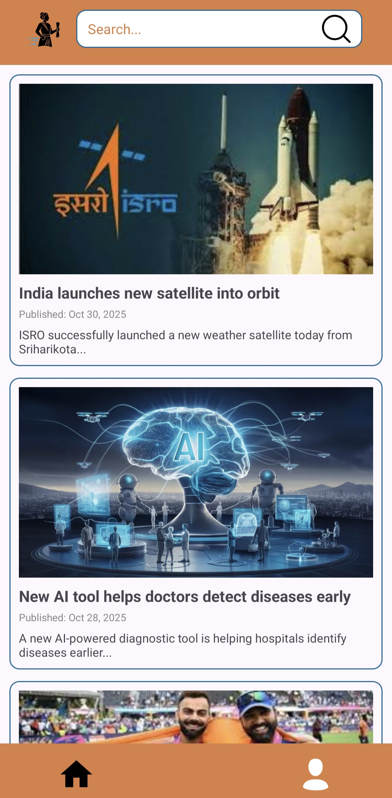
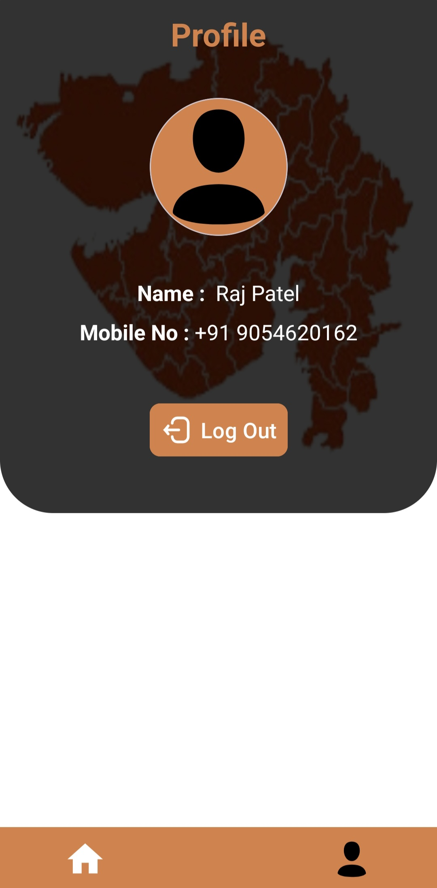

# 📰 Rajdoot News App

**Rajdoot** is a simple and elegant Android news application built as a **college assignment project**.  
The app provides a clean user interface that lets users explore static news articles and navigate between different screens like Login, Signup, Home, and Profile — all **without using any database or backend**.

---

## 📱 App Screenshots

| Splash Screen | Sign-Up Screen | Login Screen |
|----------------|----------------|---------------|
|  |  |  |

| Home Screen | Profile Screen |
|--------------|----------------|
|  |  |

> 🖼️ *Replace the above paths (e.g., `screenshots/splash.jpg`) with actual image file paths from your project.*

---

## 🌟 Features

- 📰 **News Feed:** Displays multiple news cards with titles and images.  
- 🔍 **Search Bar:** Quickly find news items (UI only).  
- 👤 **User Authentication (UI only):** Includes Sign-Up and Login screens with OTP design.  
- 🏠 **Profile Page:** Simple profile layout for user details and settings.  
- 💾 **No Database Used:** Static data for design and demonstration.  
- 🎨 **Modern UI Design:** Clean layout with soft colors and ConstraintLayout components.  

---

## 🧰 Technologies Used

- **Language:** Kotlin  
- **Framework:** Android SDK  
- **IDE:** Android Studio  
- **Layout Components:** ConstraintLayout, ScrollView, CardView, ImageView, EditText, Button  
- **Design Tools:** XML-based UI  
- **Icons:** Vector Drawables  

---

## 🚀 How to Run the App

1. Clone this repository:
   ```bash
   git clone https://github.com/raj-patel-2316/Rajdoot
